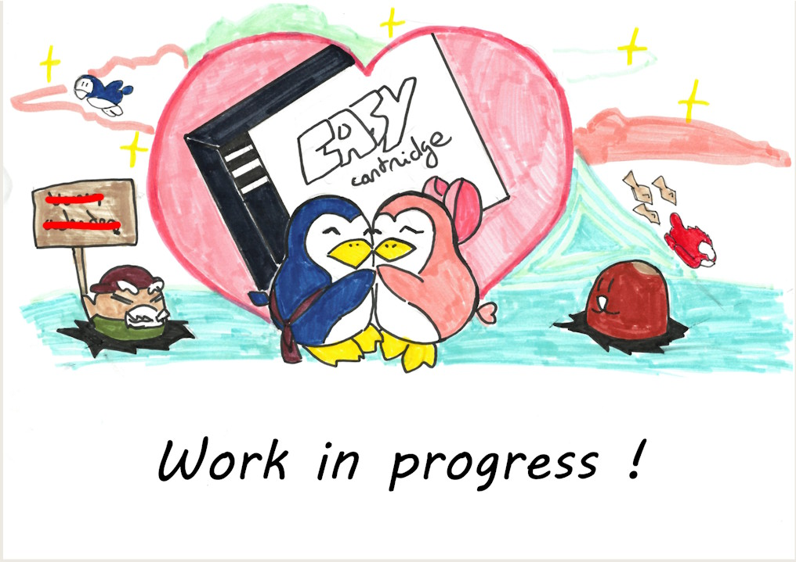
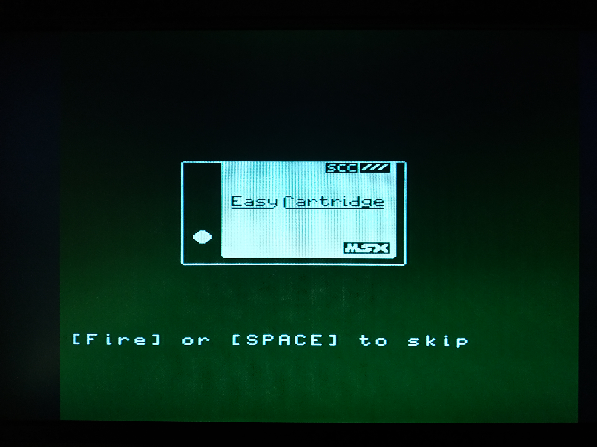

# MsxEasyCartridge (Work in progress)
Msx Easy Cartridge is an user friendly cartridge linker for MSX : it allows to run MSX cartridge rom up to 128Ko.
It is based on a Rasberry Pi pico with 14Mo built in flash memory and is made as easy to use with a built-in cartridges browser.
## Release changes
### v 0.34
* Save Rom Browser configuration :
    * the selected folder and rom file are save in to the configuration file.
    * when the MSX restart, the Rom Browser will directly go to the proviously selected folder and select the previously selected rom file.
### v 0.33
* New mappers are supported :
    * ASCII 8 (SRAM) : ASCII 8 with SRAM cartridge rom
    * ASCII 16 (SRAM) : ASCII 16 with SRAM cartridge rom
    * ASCII 16 (Generic) : ASCII 16 Generic cartridge rom
    * Konami (Generic) : Konami Generic cartridge rom
    * GameMaster2 : Konami Game Master 2 cartridge rom (with SRAM emulation)
    * FMPAC : FMPAC rom (without YM2413 emulation)
* Using a database (exported from BlueMSX database) to find the rom type.
## Functionalities
* Run MSX cartridge - supported cartridge types :
  * Standard (or plain) cartridge from 8Ko to 64ko
  * Basic cartridge (cartridge written in MSX Basic)
  * Ascii 8 mapper cartridge
  * Ascii 16 mapper cartridge
  * Konami mapper cartridge
  * Konami **with SCC emulation** mapper cartridge
  * Konami Game Master 2 cartridge (with SRAM emulation using Easy Cartridge bilt-in flash memory)
  * Ascii 8 SRAM mapper cartridge
  * Ascii 16 SRAM mapper cartridge
* 64Ko RAM extension
* 128Ko Mapper RAM extension
* SCC without ROM cartridge emulation
* long file / directory name is supported
**When using Konami Game Master 2, please wait a few second before shutting down or resetting the Msx to a allow the Easy Cartridge to save the SRAM on the flash memory.**
## Limitations
* rom size is limited to 128Ko due to the limited available RAM of the Pico
* only 14Mo flash memory available
* file (or directory) name is limited to 125 characters
## Usage
### Adding ROMs into Easy Cartridge
1. Connecting Easy Cartridge to a PC with a USB C - USB A cable.
2. Under Windows, an amovable FAT drive volume named "MSXEASYCART" is added to the PC
3. Copying rom images on the cartridge, on MSXEASYCART drive. It's highly recommanded to organized rom image files in subfolders if there are a lot of rom images.
4. Unmounting (or ejecting) the drive MSXEASYCART and disconnect the USB cable
5. Plugging Easy Cartridge to the MSX and powering up the MSX
6. Easy Cartridge built-in rom (the ROM Browser) should start and the user can select a rom image to launch by using a joystick or by using arrow keys, [Space] bar and [Backspace] key of the keyboard.
### Updating Easy Cartridge firmware
1. Connecting Easy Cartridge to a PC while pressing the boot button (button next to the USB C connector on the left of the cartidge)
2. Under Window, an amovable drive volume named "RPI-RP2" is added to the PC
3. Copying the firware file named BasicRomEmulator_v?.??.uf2 (where ?.?? is the version number) from Firware folder into "RPI-RP2" volume
4. Once the firmware file is copied, the volume "RPI-RP2" is automatically unmounted and an new amovable FAT drive volume named "MSXEASYCART" is mounted
5. Copying the folder .sys and its content into "MSXEASYCART"
6. Unmounting (or ejecting) the drive "MSXEASYCART" and disconnect the cartridge from the PC.
## The ROM Browser
### Splash screen

At startup of the MSX with Easy Cartridge plugged in, the Rom Browser is launched. This animated splash screen is displayed and automatically closed at the end (but you can skip it by pressing the joystick button or [Space] bar);
### Main screen

Here is the main screen of the ROM Browser : it displays the content of the root folder of the build in flash memory where your roms are copied.

You can use the joystick or arrow keys to navigate in the files/folders list.
* Joystick up and down or [Up] and [Down] keys to go up and down in the list
* Joystick left and right or [Left] and [Right] keys to go to next or previous page in the list.
You can press the joystick button 1 or [Space] bar to enter into a folder or to go to the Game launch screen to start the ROM.
To go back to the parent folder or to a previous screen you can press the joystick button 2 or [Backspace] key.
You can as well to back to the parent folder by selecting the special file named "..".
### Game launch screen

Game launch screen displays some information and parameters you can modify before starting the selected game.
* ROM type : the cartridge ROM type
* Init Addr : ROM start address
* Start everytime
* Start
To start the game you can select "Start" or "Start everytime"
#### ROM type
Easy Cartridge automatically detects the cartridge rom type and displays it.
Here is some rom types supported by Easy Cartridge
* Standard or linear 8/16/32Ko rom
* Basic : MSX Basic cartridge rom
* ASCII 8 : ASCII 8 cartridge rom
* ASCII 8 (SRAM) : ASCII 8 with SRAM cartridge rom
* ASCII 16 : ASCII 16 cartridge rom
* ASCII 16 (SRAM) : ASCII 16 with SRAM cartridge rom
* ASCII 16 (Generic) : ASCII 16 Generic cartridge rom
* Konami : Konami without SCC cartridge rom
* Konmai SCC : Konami with SCC cartridge rom
* Konami (Generic) : Konami Generic cartridge rom
* GameMaster2 : Konami Game Master 2 cartridge rom (with SRAM emulation)
* FMPAC : FMPAC rom (without YM2413 emulation)
You can change the rom type if you think it's wrong by pressing the joystick button 1 or [Space] bar or left and right.
#### Init Addr
It's the rom start address. It's just for information.
#### Start and Start everytime
* Start : to start the game
* Start everytime : to start the game but when you shutdown the MSX and restart it, the selected game will be automatically launch again. Easy Cartridge acts as it a simple cartridge game. To go back to the ROM Browser, you have to pressed the 'Restore' button on the top-right corner of the cartridge and keep it pressed while restarting the MSX.
### Options screen

In this screen you can access to other functionalities of Easy Cartridges
* FM Pana Amusement Cartridge (*Note: work in progress, not fully working*)
* Scc only (no game)
* 64kB RAM expansion
* 128kB Mapped RAM expansion
* Exit to BASIC
#### FM Pana Amusement Cartridge
*This function is under developpement and is not fully working.*
Easy Cartridge emulates the FM Pana Amusement Cartridge. The function will persist after the MSX shutdown. You have to restart the MSX with the 'Restore' button pressed to go back to the ROM Browser.
#### Scc only (no game)
This function emulate a modified SCC cartridge where the SCC chip is fully working but there no game ROM with it. It usually used to run some homebrews which need a SCC chip. The function will persist after the MSX shutdown.
#### 64kB RAM expansion
This function emulate a 64kB RAM expansion for MSX 1 which has less than 64kB built-in RAM. It expands the MSX to 64kB RAM. The function will persist after the MSX shutdown.
#### 128kB Mapped RAM expansion
This function emulate a 128kB mapped RAM expansion. It adds 128kB RAM to the MSX as a mapped RAM. The function will persist after the MSX shutdown.
#### Exit to BASIC
Exit the ROM Browser and go to MSX Basic.
### Help screen

Help screen displays buttons and keys shortcuts.

